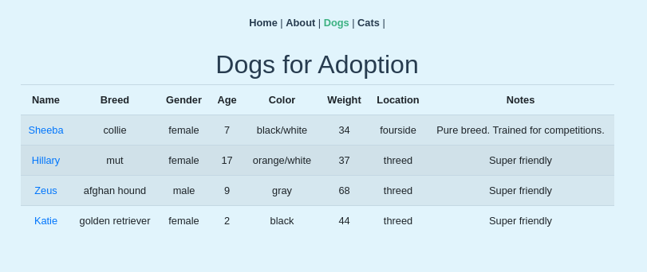
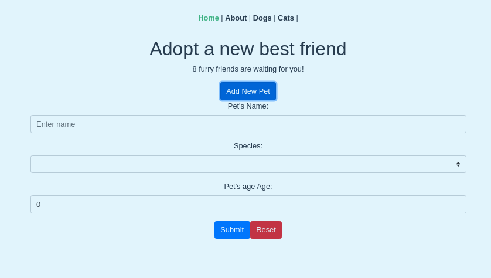

# Keyword Analyzer

[![Contributors][contributors-shield]][contributors-url]
[![Forks][forks-shield]][forks-url]
[![Stargazers][stars-shield]][stars-url]
[![Issues][issues-shield]][issues-url]

> This is a project based on the FreeCodeCamp tutorial on YouTube. It features the creation and update of a database, the use of the store feature on Vue, Vuex, and bootstrap-vue. In this app, we display the cats and dogs available to adopt through a component table that we reuse for both.





## Built With

### Developing tools

- Vue
- Vuex
- Bootstrap

## Getting Started

To get started with the app, please follow these steps:

- Navigate to the folder where you would like to save the app.

- Open your terminal by right-clicking, and opening the command line of your choice.

- Clone the repo by typing:

```
$ git clone git@github.com:lmaldonadoch/adopt-pet.git
```

- Access the newly created folder by typing:

```
$ cd adopt-pet
```

- Install the necessary dependencies:

```
npm install
```

- Bundle the resources and run the code locally:

```
$ npm run serve
```

- Open [http://localhost:8080/](http://localhost:8080/) on your browser.

### Prerequisites

- Node. If you do not have Node installed in your local machine, please refer to the [Official Documentation](https://nodejs.org/en/download/)
- Vue-CLI. If you do not have Vue-CLI installed in your local machine, please refer to [Official Documentation](https://cli.vuejs.org/)
- Basic command line knowledge.

## Author

👤 **Luis Angel Maldonado**

- Github: [@lmaldonadoch](https://github.com/lmaldonadoch)
- Twitter: [@LuisAngelMCh](https://twitter.com/LuisAngelMCh)
- LinkedIn: [lmaldonadoch](https://www.linkedin.com/in/lmaldonadoch)

## 🤝 Contributing

Feel free to check the [issues page](https://github.com/lmaldonadoch/adopt-pet/issues).

## Aknowledgement

- Project based on the [freeCodeCamp.org tutorial on YouTube](https://youtu.be/4deVCNJq3qc)

## Show your support

Give a ⭐️ if you like this project!

<!-- MARKDOWN LINKS & IMAGES -->

[contributors-shield]: https://img.shields.io/github/contributors/lmaldonadoch/adopt-pet.svg?style=flat-square
[contributors-url]: https://github.com/lmaldonadoch/adopt-pet/graphs/contributors
[forks-shield]: https://img.shields.io/github/forks/lmaldonadoch/adopt-pet.svg?style=flat-square
[forks-url]: https://github.com/lmaldonadoch/adopt-pet/network/members
[stars-shield]: https://img.shields.io/github/stars/lmaldonadoch/adopt-pet.svg?style=flat-square
[stars-url]: https://github.com/lmaldonadoch/adopt-pet/stargazers
[issues-shield]: https://img.shields.io/github/issues/lmaldonadoch/adopt-pet.svg?style=flat-square
[issues-url]: https://github.com/lmaldonadoch/adopt-pet/issues
